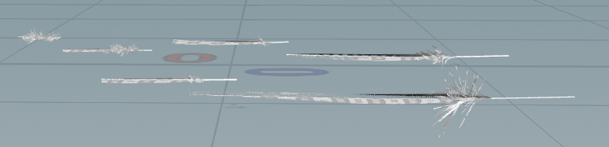
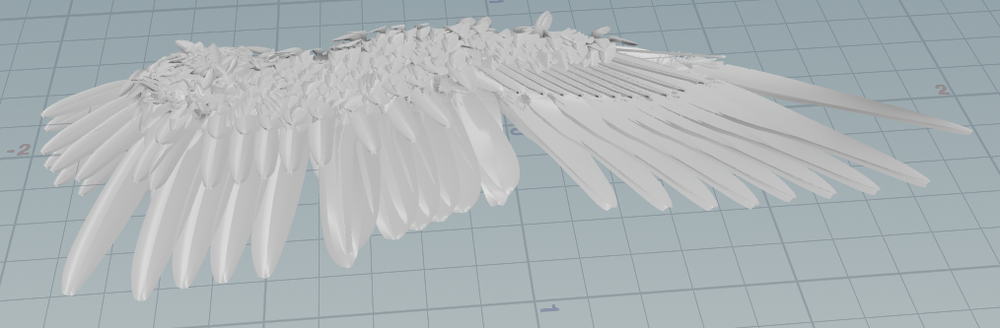
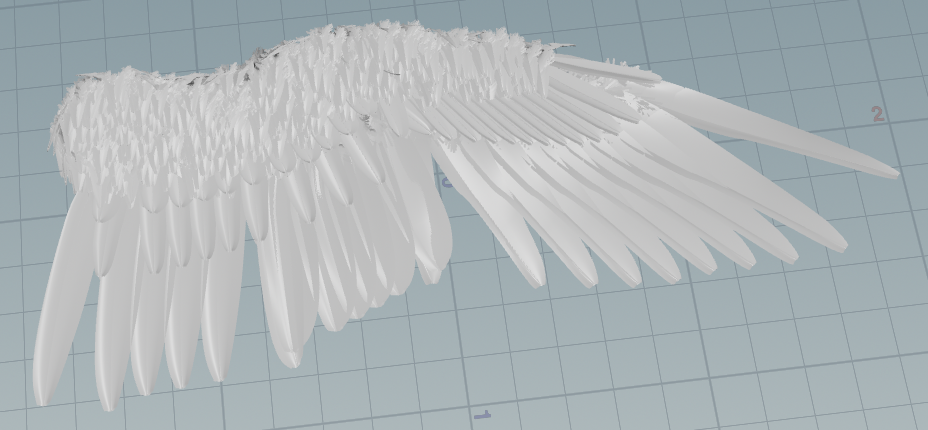
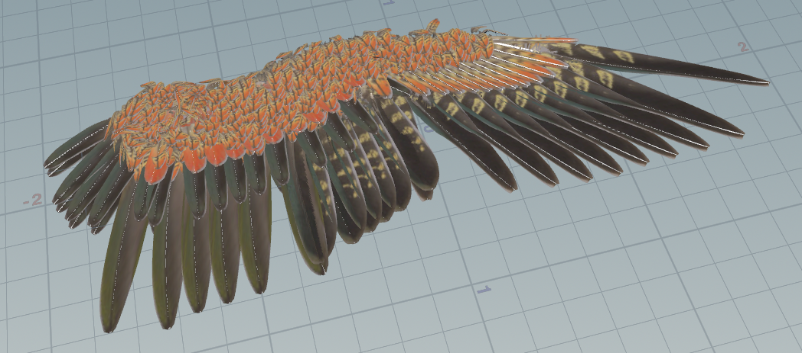
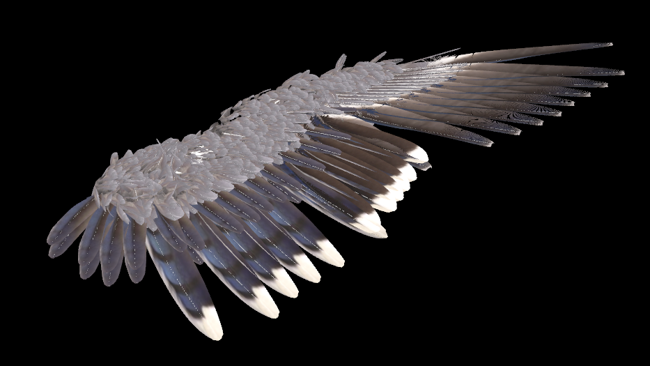
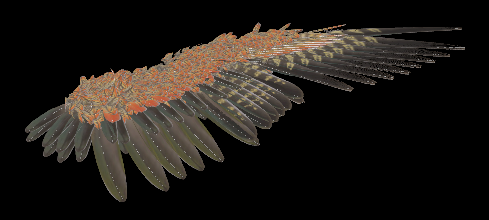

# Procedural Bird Wings

## Milestone #1

For Milestone 1 I've been focused on creating and modeling base feathers to work off of in houdini. 

||
|:--:|
|*Bird Wing Reference Image*|

As can be seen in the above diagram different parts of a birds wings have different types of feathers. The largest groups are the flight wings and consist of the primaries, secondaries, and terials (to the inside of the secondaries), and as we move closer to the base of the wing there are the different types of covert feathers greater covert, median covert, lesser covert, and primary covert (Grouped into secondary and marginal vs primary covert feathers in this diagram).

|||
|:--:|:--:|

We can more easily see the differences between the kinds of feathers through real life layouts like those above. The different kinds of feathers have different shapes, patterns, and fluffyness to them.

Now to actually model feathers in houdini, I started off with a simple feather without much variation using Houdini 20's feather workflow.

From there, working from the feather layouts above I created different base feather's corresponding to each of the types of feathers. Moving forward I'll use these as bases to procedurallly generate feathers to place on my wing.
|||
|:--:|:--:|

Right now while I haven't hit all of my project goals of having most of the generator created, I was able to make the feathers themselves a lot more detailed than what I was expecting. Because of this though they took up most of my time, but it means I'll be able to produce higher quality wings moving forward. Most of what's been giving me trouble so far is just working within Houdini's feather workflow, because while it is very powerful the nodes are quite unfamiliar to me and there aren't a lot of good resources on the many ways to use them. Lastly, the bulk of the wings will be based on procedurally placing said feathers so even though I haven't gotten to that yet I believe I should still be on track. 

## Milestone #2

This milestone I focused on the process of procedurally placing and altering the feathers. As a first step from my base feathers I created a feather layout similar to my references from milestone 1. I also created uvs for my feathers so that they could be textured from a reference image of the wings of a Kea.
Feather Spread Image

The next step was to actually create a wing from the feathers. I settled on the base wing shape below to start with, but my base feathers had a lot of problems based on their thickness, and having their barbs poke through eachother.
||
|:--:|

I first focused onn adjusting the way I procedurally placed the feathers to be. based on two curves, one for the base of the feathers and one for the tips, so that I could then raise the later curve on the covert feathers so that they could be seen ontop of the main flight feathers.

I also adjusted the width and noise used for the barbs of the feathers so that they were less vertical and wouldn't interfere with eachother. 
|||
|:--:|:--:|

Lastly I also experimented with grooming to procedurally place a bunch of feathers at once which I'll use in the future for the base of my wing.

|||
|:--:|:--:|

I think I'm pretty on track for my milestone 2 goals, allthough I would like to make the wing I generate look more cohesive and grounded which I think adding the base of the wing will help a lot with before the final submission. Additionally now that I have most of the tools for creating the wing set up, I want to expirement more with different textures and wing poses moving forward.

## Final Results

## Post Mortem

## References
* [Avian Report: Ornithology and Bird Biology](https://avianreport.com/ornithology-bird-biology/)
* [Everything You Need To Know About Feathers](https://academy.allaboutbirds.org/feathers-article/)
* [The Form and Motion of Real Birds: Morphology of Aves](https://falconsongstudios.com/bird-anatomy)
* [Birdify: Wing Shapes](https://www.birdfy.com/blogs/blogs/types-of-bird-wings-everything-you-need-to-know?srsltid=AfmBOooqPglGS5LFMCmoPbHOaWTLjkM7Vb7iix4vRPwi86O1jhLUzl7k)
* [How To Draw Wings](https://www.clipstudio.net/how-to-draw/archives/168451)
* [Featherbase](https://www.featherbase.info/en/species/Erithacus/rubecula)
* [Feathers - Simulating and Rendering](https://www.youtube.com/watch?v=rmIA-krfvXk&list=PLe0XlBlHzrpWeE5Mip7AOyXdEyR8jbrXe&index=9)
